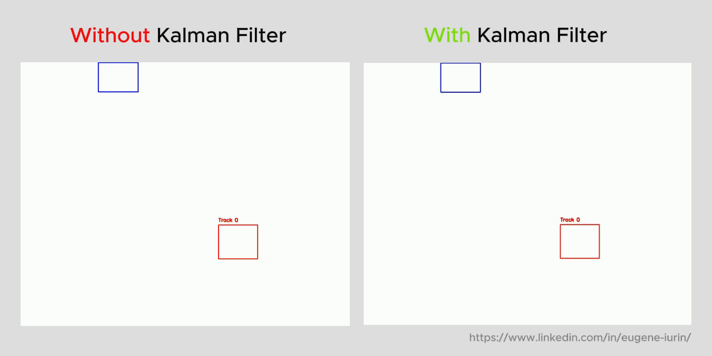

## Tracker Soft

### Overview

Для реализации **soft trackera** мы использовали

- Венгерский алгоритм
- Фильтр Кальмана.

Входные данные:

- центр bounding box'ов
- bounding box'ы из алгоритма детекции для подсчета IoU

### Венгерский алгоритм

Изначально, мы реализовали только венгерский алгоритм, который решал проблему назначения.
Как "стоимость" (cost matrix) использовали IoU bounding box'a с
прошлого фрейма и bounding box для текущего фрейма.

Этот подход имеет свои определенные минусы.

1. Если детектор на срабатывал несколько фреймов подряд, то текущий bounding box уже не имеет
   релеватную "пару" для сравнения, поскольку мы будем считать IoU для текущего bounding box'a и
   для bounding box'a c (t-N)-ого кадра, врядли эти боксы будут иметь хоть какое-то пересечение. В итоге,
   целый трек будет удален из большого числа пропусков.
2. Смешение треков. При пересечение обьектов матрица стоимости может построится таким образом, что
   треки в итоге будут соотнесены к разным обьектам. Мы свизуалиризовали подобную ситауцию.

> Note : Этот метод - это не полноценный трекер, он не учитывает иные факторы - например скорость.

### Фильтр Кальмана

Для решения ранее описанных проблем был использован фильтр Калмана.
В качестве модели движения применялась матрица перехода в двумерном пространстве с шагом времени Δt = 1.
Наблюдения включали только координаты центра bounding box’а.
Предсказания фильтра использовались для сглаживания и устранения шумных детекций, не соответствующих ожидаемой траектории.

Иными словами, сначала рассчитывается предполагаемое положение объекта (центра) для каждого активного трека,
затем вычисляется расстояние между этим положением и центром каждой новой детекции.
Если расстояние меньше заданного порога (20 пикселей), то производится расчёт IoU между предсказанным и фактическим bounding box.
На основе полученной матрицы "стоимостей" сопоставлений применяется венгерский алгоритм,
который позволяет определить наилучшее соответствие между треками и новыми детекциями.

Какие могут быть опасности:

- Обьект может двигатья очень хаотично, быстро изменяя скорость

### Метрики

Для метрики мы использовали precision:
    - если для данного трека prediciton == grand truth (номер трека), correct +=1
    - иначе , correct += 0

metric = correct / number of frames where we have detection (bounding box != [])

### Tracker (основные пункты)

- Создаётся новый трек, если обнаруженная детекция не сопоставлена ни с одним существующим треком
- Трек удаляется, если он не обновлялся более 10 кадров подряд (missed > 10)
- Евклидово расстояние и IoU применяются для оценки соответствия между предсказанием и детекцией
- Счётчик пропущенных кадров увеличивается для треков без сопоставления (missed += 1)
- Детекции без bounding box фильтруются и добавляются обратно в итог без трекинга

## Таблица с результатами

| № | Filename             | tracks_amount | random_range | bb_skip_percent | metric SOFT | metric STRONG |
| -- | -------------------- | ------------- | ------------ | --------------- | ----------- | ------------- |
| 1  | tracks_t5_r0_s0.py   | 5             | 0            | 0.0             | 0.9838      | 1.0000        |
| 2  | tracks_t5_r2_s25.py  | 5             | 2            | 0.25            | 0.6752      | 0.2136        |
| 3  | tracks_t5_r5_s50.py  | 5             | 5            | 0.5             | 0.4791      | 0.4166        |
| 4  | tracks_t10_r0_s0.py  | 10            | 0            | 0.0             | 0.9114      | 0.5685        |
| 5  | tracks_t10_r2_s25.py | 10            | 2            | 0.25            | 0.2346      | 0.3538        |
| 6  | tracks_t10_r5_s50.py | 10            | 5            | 0.5             | 0.2095      | 0.0898        |
| 7  | tracks_t20_r0_s0.py  | 20            | 0            | 0.0             | 0.9494      | 0.5898        |
| 8  | tracks_t20_r2_s25.py | 20            | 2            | 0.25            | 0.1122      | 0.0489        |
| 9  | tracks_t20_r5_s50.py | 20            | 5            | 0.5             | 0.0743      | 0.0743        |
